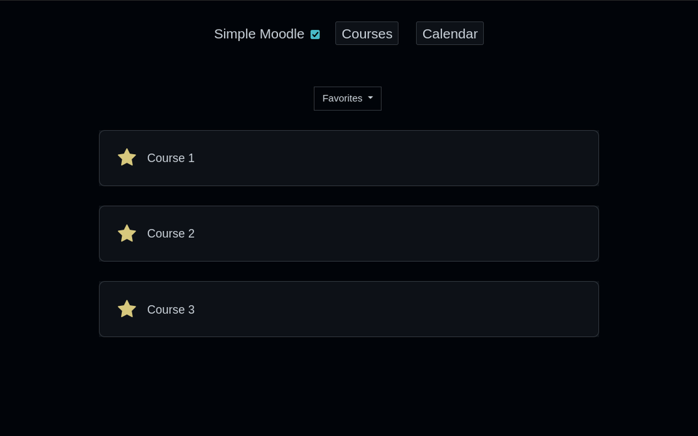
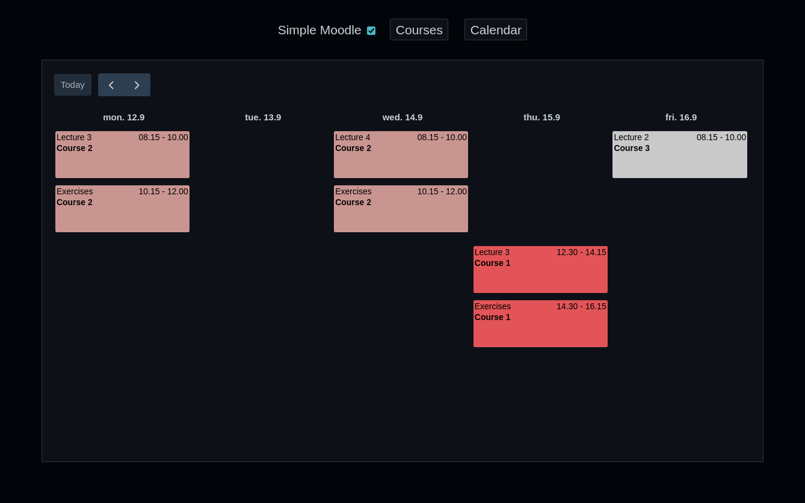

# Simple Moodle

Moodle is a bloated mess. Most of the time you just need to quickly find a course, but Moodle will present you with 13962 random buttons that each do some specific thing, and will make sure to thoroughly hide the course you're looking for somewhere in a corner.

Simple Moodle allows you to enable a simpler view that highlights what you are looking for 99% of the time, and removes all the other bloat. For the other 1% of the time where you really do need an advanced button, you can easily disable the view, do your thing, and then reenable it to get back to your normal and simple 99% workflow again.

## Get it
 |  Firefox [Install here](https://addons.mozilla.org/en-US/firefox/addon/simple-moodle/) |  Chrome [Install here](https://chrome.google.com/webstore/detail/simple-moodle/fbmkgaebooghmoldfmjgedkomjkkfgao) |  Edge [Find a guide](https://www.qwant.com/?q=How+to+install+Chrome+extensions+in+Edge) |
|:--:|:--:|:--:|

## Overview

## Calendar

